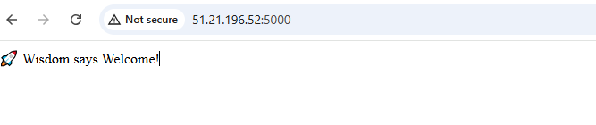

# 🧠 Wisdom Flask App 🚀

A simple, production-ready Flask web application containerized with Docker and built via GitHub Actions CI/CD. Perfect as a DevOps portfolio project.

---

## 📷 App Screenshot




---

## 📦 Features

- ✅ Python Flask web application
- ✅ Dockerized using lightweight Python base image
- ✅ Automated Docker builds with GitHub Actions
- ✅ Image hosted on Docker Hub
- ✅ Easily deployable to AWS EC2, GCP VM, or any Linux server

---

## 🐳 Docker

### 🔧 Build Locally

```bash
docker build -t wisdom-flask .


🚀 Run Locally

docker run -p 5000:5000 wisdom-flask
Then visit: http://localhost:5000

🔁 GitHub Actions CI/CD

This project uses GitHub Actions to:

Build the Docker image on every push to main

Push the latest image to Docker Hub

📁 GitHub Actions Workflow:

.github/workflows/docker-build.yml
🐋 Docker Hub
👉 Docker Image:
https://hub.docker.com/r/yourdockerhubusername/wisdom-flask

You can pull and run it with:


docker pull yourdockerhubusername/wisdom-flask
docker run -p 5000:5000 yourdockerhubusername/wisdom-flask

🌐 Deployment (Coming in Week 2)
This app will be deployed to:

 AWS EC2 (manual setup)

 AWS EC2 via Terraform + Ansible

 Kubernetes (optional)

Stay tuned for updates in the deploy/ folder!

📁 File Structure

wisdom-flask/
├── app.py
├── requirements.txt
├── Dockerfile
├── .dockerignore
├── README.md
└── .github/
    └── workflows/
        └── docker-build.yml
