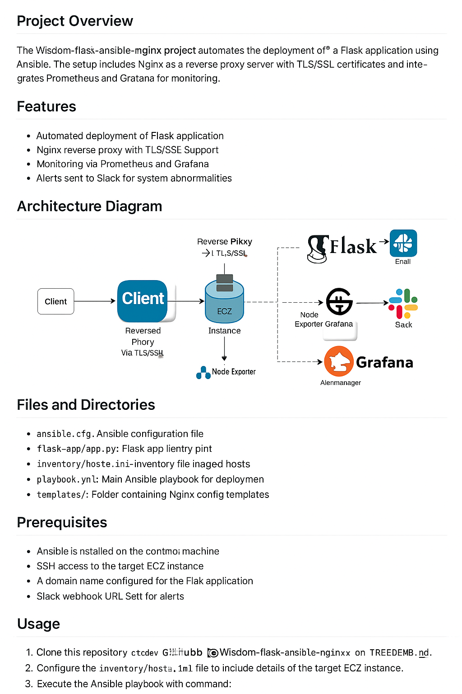
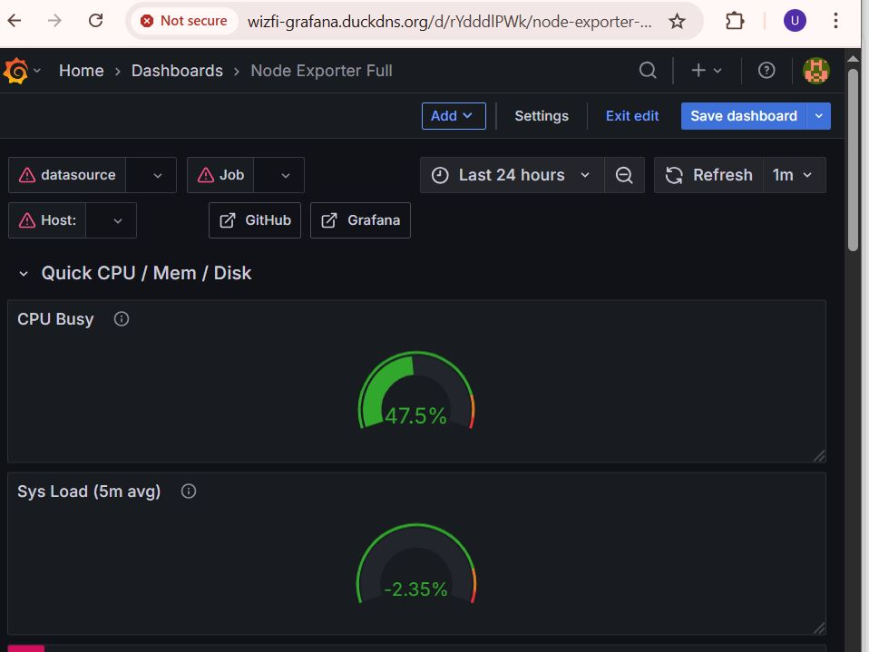
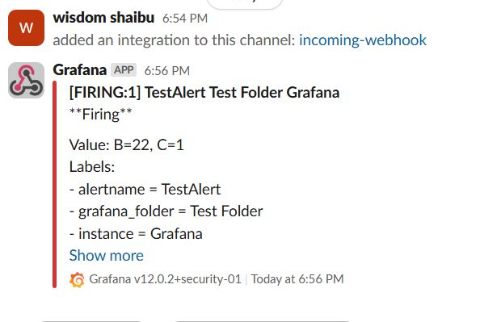
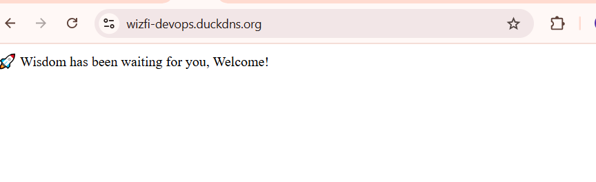
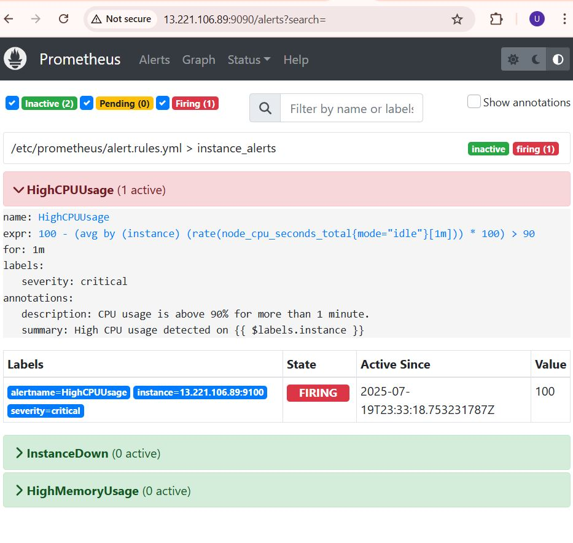

# 🚀 Wisdom Flask Ansible NGINX


---


## 📌 About the Project

**Wisdom-flask-ansible-nginx** is a full production-ready Flask app deployed on an AWS EC2 instance using **Terraform**, **Docker**, and **Ansible** — complete with:

- Automated CI/CD via GitHub Actions
- Real-time monitoring using Prometheus + Grafana
- NGINX reverse proxy with **Let's Encrypt SSL**
- Ngrok for local testing
- Fully containerized and infrastructure-as-code


---

## 🧱 Architecture Overview



---

## ⚙️ Features

- 🔄 **GitHub Actions** automatically builds + pushes Docker images
- ☁️ **Terraform** provisions EC2 infra
- 🚀 **Ansible** deploys full stack: Docker, Flask app, NGINX, Prometheus, Grafana
- 🔐 **HTTPS with Let's Encrypt** using Certbot
- 📊 **Live Monitoring**: CPU, Memory, App Health via Grafana dashboard
- 🔁 Ngrok tunnel for local dev testing (secure preview)

---

## 🧪 Monitoring & Alerting

- 📈 **Prometheus** scrapes EC2 + Node Exporter metrics
- 📊 **Grafana** dashboards visualize system + app health
- 🔔 **Slack Alerts** for high CPU usage (Grafana contact points via SMTP)

---

## 🚀 Run This Project

### 🔧 1. Clone and configure secrets

```bash
git clone https://github.com/wizzfi1/Wisdom-flask-ansible-nginx.git
cd Wisdom-flask-ansible-nginx


🏗️ 2. Provision Infra (EC2) with Terraform

cd infra
terraform init
terraform apply


🤖 3. Deploy App via Ansible

cd ansible
ansible-playbook -i inventory.ini site.yml

```
🌍 Live Demo
yaml

You can preview your app locally using Ngrok:

ngrok http 5000

Or visit the public HTTPS URL hosted via NGINX + Certbot on EC2.

📊 Dashboard Example

> Real-time system metrics displayed on Grafana


---

## 🔔 Slack Alert Example

> Automatically triggered alert for high CPU usage



---

## 🌐 Deployed Flask App

> App deployed with HTTPS via NGINX + Let's Encrypt



---
```

> Real-time system metrics displayed on Prometheus




🧠 Skills Demonstrated

✅ End-to-end Infrastructure-as-Code

✅ Real-world CI/CD pipeline

✅ Secure reverse proxy & HTTPS

✅ Monitoring & observability

✅ Reproducible, production-grade setup


📂 Folder Structure Highlights

Wisdom-flask-ansible-nginx/
├── .github/workflows        # CI/CD GitHub Actions
├── ansible/                 # Ansible roles: flask, nginx, grafana, prometheus, etc
├── infra/                   # Terraform infra code
├── app.py                   # Flask application
├── docker-compose.yml
├── Dockerfile
├── README.md


🪪 License
MIT — feel free to use and build upon this project.
